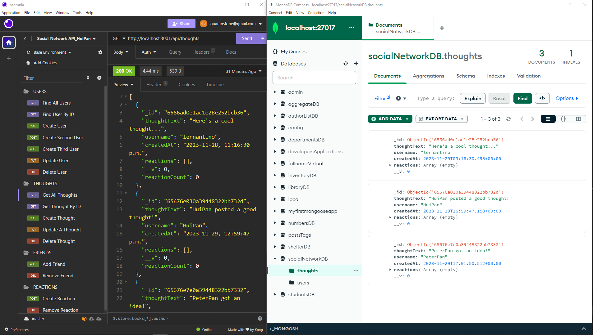

# Social-Network-API_HuiPan

[](https://github.com/siennameow/social-network-API/blob/main/LICENSE)

## Description

This is an API for a social network web application where users can share their thoughts, react to friends' thoughts, and create a friend list. It uses `Express.js` for routing, `MongoDB` for database and the `Mongoose` for object modeling. The seed data is created by using `Insomnia`.

To see how the API works by using Insomnia, see the **walk-through demonstration videos** here:[Click!](https://github.com/HuiPan-Peter/Social-Network-API_HuiPan/tree/main/public/walkthroughVideo%26Screenshot)

## Table of Contents

- [Application Preview](#application-preview)
- [Installation](#installation)
- [Usage](#usage)
- [Contribution](#contribution)
- [Questions](#questions)


## Application Preview

All GET, POST, PUT, and DELETE routes for Users, Thoughts, Friends, and Reactions.
By using Insomnia to test these routes with JSON text on MongoDB.


## Installation

- Download or clone repository to use this application on local machine.
- `Node.js` and `MongoDB` is required to run the application
- To install necessary dependencies, navigate to the root directory and run the following command:
  `npm i`

## Usage

For more information - Please visit the walkthrough demo on how the application works.
[Demo Video](https://github.com/HuiPan-Peter/Social-Network-API_HuiPan/tree/main/public/walkthroughVideo%26Screenshot)

#### Starting the Server

After installation :
- To invoke the application, run `npm start`.
- When the server is started, the Mongoose models are synched to the MongoDB database.
- Open MongoDB and connect to the MongoDB URI `mongodb://localhost:27017`. On the list of databases, click on `socialNetworkDB` to check the `thoughts` and `users` documents.
- To create seed data and test the API routes, by using [Insomnia](https://insomnia.rest/download).

#### Testing API Endpoints

You can test the API endpoints using Insomnia or a similar tool.

#### GET Routes

- To retrieve user data, make a GET request to `http://localhost:3001/api/users` for all users.
  
- To retrieve user data by ID, make a GET request to `http://localhost:3001/api/users/{userId}` for a specified user.

- To retrieve thought data, make a GET request to `http://localhost:3001/api/thoughts`.
  
- To retrieve thought data by ID, make a GET request to `http://localhost:3001/api/users/{thoughtId}` for a specified thought.

Example: GET `http://localhost:3001/api/users` should return a formatted JSON response containing all user data.

#### POST Routes

- To create a new user, make a POST request to `http://localhost:3001/api/users`.

- To create a new thought, make a POST request to `http://localhost:3001/api/thoughts`.

- To add a new friend to a user, make a POST request to `http://localhost:3001/api/users/{userId}/friends/{friendId}`, where `{friendId}` is the ID of an existing user who has been added to another by his/her specified {userId} . 

- To create a reaction to a thought, make a POST request to `http://localhost:3001/api/thoughts/{thoughtId}/reactions`, where `{thoughtId}` is the ID of an existing thought. 

Example: POST `http://localhost:3001/api/users` should allow you to create a new user by sending the required user data in the request body.
```json
// user data
{
  "username": "lernantino",
  "email": "lernantino@gmail.com"
}
```

#### PUT Routes

- To update user or thought data, make a PUT request to the appropriate route, use `http://localhost:3001/api/users/{userId}` or `http://localhost:3001/api/thoughts/{thoughtId}`;

Example: PUT `http://localhost:3001/api/users/{userId}` should allow you to update user data by providing the updated data in the request body and the ID of an existing user in place of `{userId}`.

#### DELETE Routes

To delete a user, thought, friend or reaction, make a DELETE request to the appropriate route.
- Delete a user by its `id`: use DELETE `http://localhost:3001/api/user/{userId}`
- Delete a thought by its `id`: use DELETE `http://localhost:3001/api/thoughts/{thoughtId}`
- Delete a friend from a user's friend list: use DELETE `http://localhost:3001/api/users/{userId}/friends/{friendId}`
- Delete a reaction by the `reactionId`: use DELETE `http://localhost:3001/api/thoughts/{thoughtId}/reactions/{reactionId}`

Example: DELETE `http://localhost:3001/api/users/{userId}/friends/{friendId}` should delete a user with friendId from the friend list of the user with userId.

## Contributing

I welcome contributions from the community to help improve and extend the Social Network API. To contribute please fork this repository, create your own branch, make your changes, test your changes, commit your changes, push your changes, create a pull request, and wait for review and discussion. If we agree on the changes after discussing them then they will be merged into the main project.

If you have questions or need assistance don't hesitate to contact me via GitHub!

GitHub: [HuiPan-Peter](https://github.com/HuiPan-Peter)

## Questions

📩 If you have any question, email me here at : guaranstone@gmail.com
